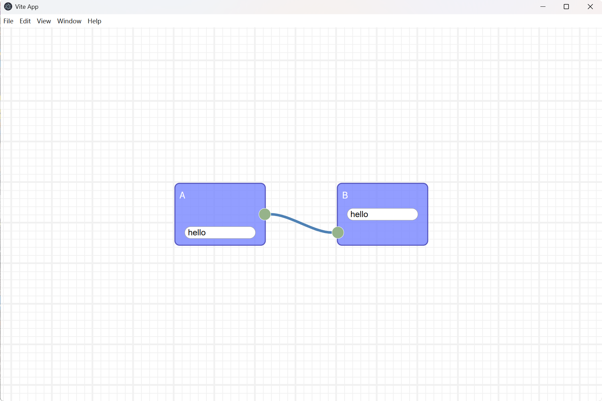

# Node-Graph

Vue.js + Electron 桌面应用程序，提供了一个可视化的节点图编辑器。

## 使用框架
- Rete.js

## 预览


## 使用方法

### 工程初始化

```sh
npm install
```

### 项目构建

```sh
npm run build
```

### 打包成桌面exe文件

```sh
npm run electron:build
```
